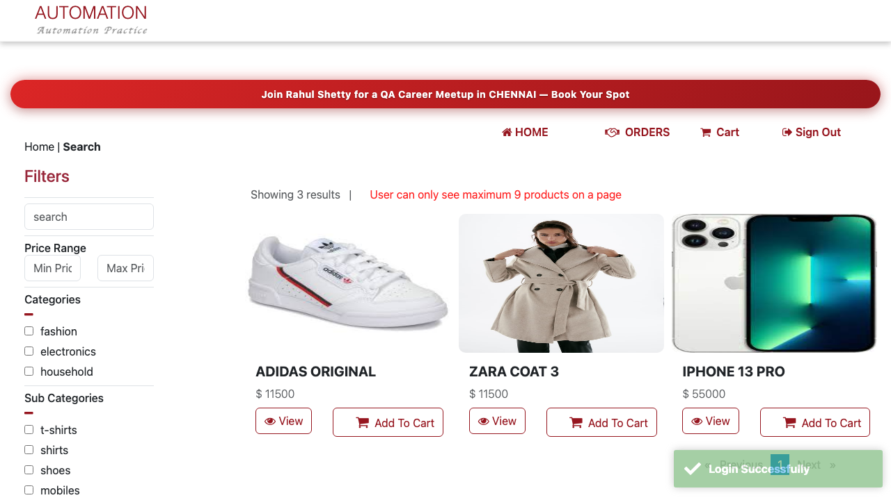
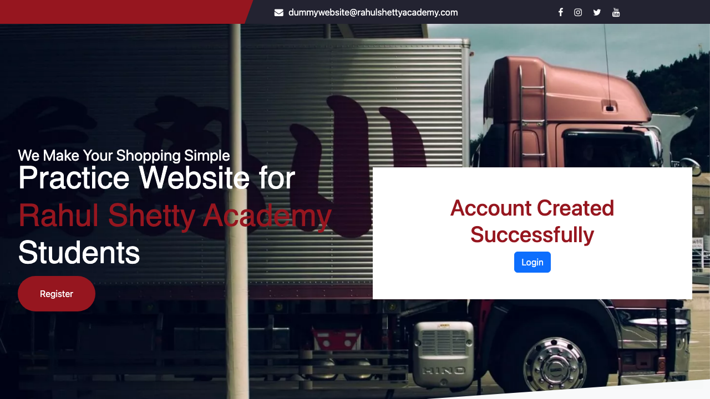
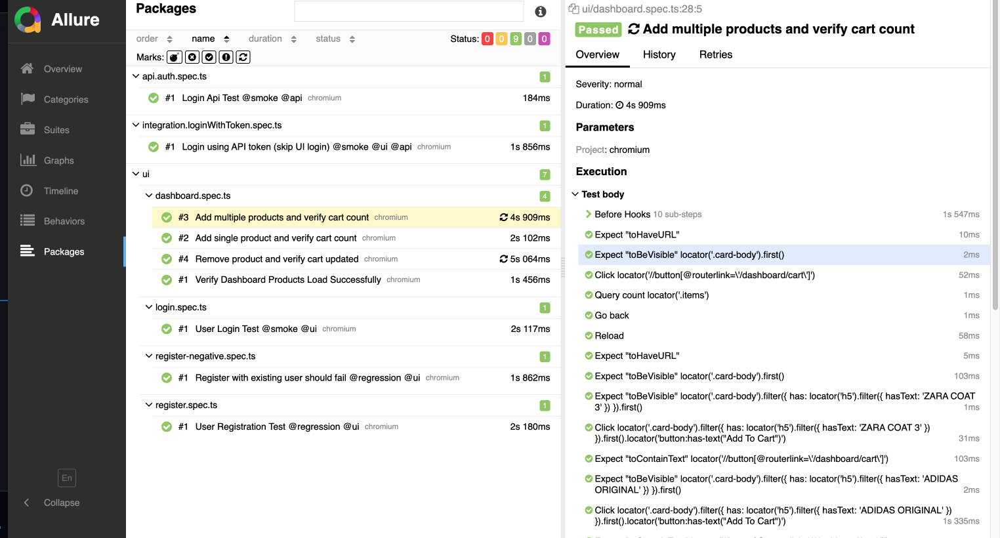

# Playwright Hybrid Automation Framework

## Overview
A scalable Playwright-based automation framework combining UI and API testing.  
Designed with a focus on stability, maintainability, and real-world test reliability.

---

## Tech Stack
- Playwright (TypeScript + JavaScript)
- Node.js
- Page Object Model (POM)
- Playwright Fixtures
- API Testing (Playwright request)
- GitHub Actions (CI/CD)

---

## Key Highlights
- Hybrid UI + API automation framework  
- API-based authentication using token injection (bypasses UI login)  
- Deterministic state-based synchronization (eliminates flaky tests)  
- Controlled test isolation to handle shared application state  
- Parallel execution for API tests and serial execution for UI tests  
- Test tagging for selective execution (smoke/regression)  
- Environment-based configuration using `.env`  
- Clean architecture with separation of Pages, API, Fixtures, and Utils  

---

## Stability Strategy (Important)
- Avoided `waitForTimeout` and unreliable waits  
- Replaced UI-based waits (toast/networkidle) with **state-based assertions**  
- Ensured synchronization using:
  - Cart state validation  
  - DOM-based visibility checks  
- Resolved headless vs headed inconsistencies  
- Handled shared session issues by controlling execution mode  

---

## Features
- UI automation (Login, Register, Cart flows)  
- API automation (Authentication & user APIs)  
- UI + API integration testing  
- Reusable fixtures for setup and authentication  
- Data-driven testing using JSON  

---

---

## Setup Instructions

### Install dependencies
```bash
npm install
```
### Install Playwright browsers
```bash
npx playwright install
```
### Add environment variables

Create a .env file:

```env
EMAIL=your_email
PASSWORD=your_password
```

### Run all tests
```bash
npm test
``` 
### Run specific test types
```bash
npm run smoke
npm run regression
```
### Run in headed mode
```bash
npm run headed
```
### Reports
```bash
npm run report
```

### CI/CD
Integrated with GitHub Actions
Executes tests on every push
Generates execution reports as artifacts


## Reports / Execution








### Key Learnings
Importance of state-based synchronization over UI-based waits
Handling flaky tests in headless execution
Managing shared session issues in parallel execution
Designing maintainable and scalable automation frameworks
